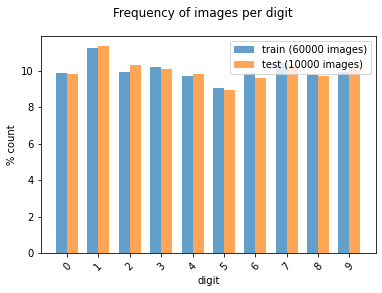
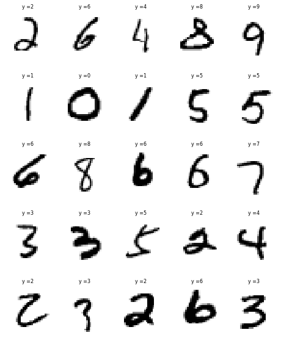
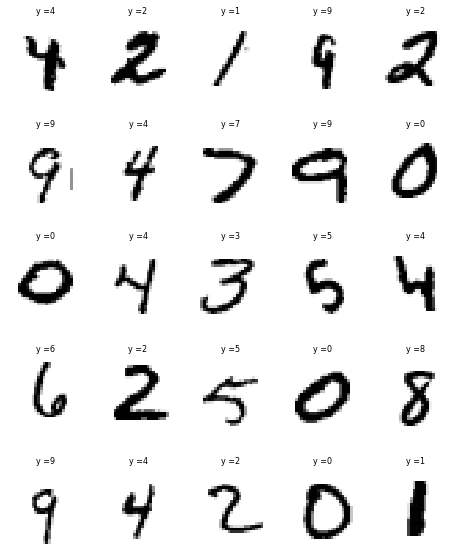
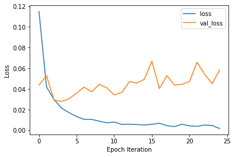
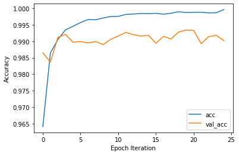
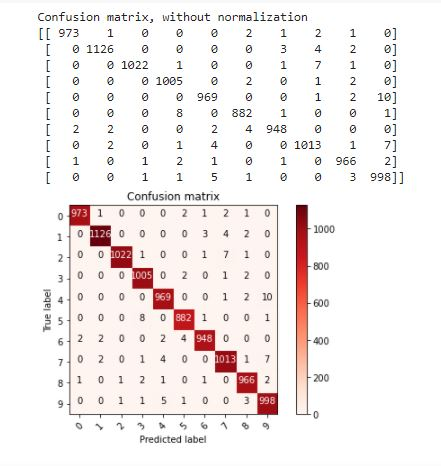
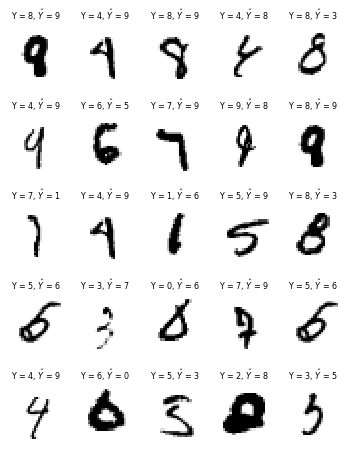

# MNIST Hand-written Digits Classification using Convolutional Neural Networks (CNN)

## 1. Objective

The objective of this section is to develop a Convolutional Neural Network (CNN) to classify hand-written digits using the widely used MNIST data set.

## 2. Motivation
The MNIST handwritten digit classification problem is a standard dataset used in computer vision and deep learning.

Although the dataset is effectively solved, it can be used as the basis for learning and practicing how to develop, evaluate, and use convolutional neural networks for image classification from scratch. 

In this section, we shall demonstrate how to develop convolutional neural network for handwritten digit classification from scratch, including:

* How to prepare the input training and test data 
* How to deploy the model
* How to use the trained model to make predictions
* How to evaluate its performance

## 3. Data

The MNIST database of handwritten digits, is widely used for training and evaluating various supervised machine and deep learning models [1]:

* It has a training set of 60,000 examples
* It has test set of 10,000 examples
* It is a subset of a larger set available from NIST. 
* The digits have been size-normalized and centered in a fixed-size image.
* It is a good database for people who want to try learning techniques and pattern recognition methods on real-world data while spending minimal efforts on preprocessing and formatting.
* The original black and white images from NIST were size normalized and resized to 28x28 binary images.

Sample images from the MNIST data set are illustrated next:
* There are significant variations how digits are handwritten by different people
* The same digit may be written quite differently by different people
* More significantly, different handwritten digits may appear similar, such as the 0, 5 and 6 or the 7 and 9.

## 4. Development

In this section, we shall demonstrate how to develop a Convolutional Neural Network (CNN) for handwritten digit classification from scratch, including:

* How to prepare the input training and test data 
* How to deploy the model
* How to use the trained model to make predictions
* How to evaluate its performance

* Author: Mohsen Ghazel (mghazel)
* Date: April 5th, 2021
* Project: MNIST Handwritten Digits Classification using Convolutional Neural Networks (CNN):

The objective of this project is to demonstrate how to develop a convolutional neural network to classify images of hand-written digits, from 0-9:

We shall apply the standard Machine and Deep Learning model development and evaluation process, with the following steps:

* Load the MNIST dataset of handwritten digits:
  * 60,000 labelled training examples
  * 10,000 labelled test examples
  * Each handwritten example is 28x28 pixels binary image.
* Build a simple CNN model
* Train the selected ML model
* Deploy the trained on the test data
* Evaluate the performance of the trained model using evaluation metrics:
  * Accuracy
  * Confusion Matrix
  * Other metrics derived form the confusion matrix.

### 4.1. Part 1: Imports and global variables
#### 4.1.1. Standard scientific Python imports:

<pre style="color:#000000;background:#e6ffff;font-size:10px;line-height:1.5;"># numpy
import numpy as np
# matplotlib
import matplotlib.pyplot as plt
# - import sklearn to use the confusion matrix function
from sklearn.metrics import confusion_matrix
# import itertools
import itertools
# opencv
import cv2
# tensorflow
import tensorflow as tf

# keras input layer
from tensorflow.keras.layers import Input
# keras conv2D layer
from tensorflow.keras.layers import Conv2D
# keras MaxPooling2D layer
from tensorflow.keras.layers import MaxPooling2D
# keras Dense layer
from tensorflow.keras.layers import Dense
# keras Flatten layer
from tensorflow.keras.layers import Flatten
# keras Dropout layer
from tensorflow.keras.layers import Dropout
# keras model
from tensorflow.keras.models import Model
# keras sequential model
from tensorflow.keras.models import Sequential
# optimizers
from tensorflow.keras.optimizers import SGD

# random number generators values
# seed for reproducing the random number generation
from random import seed
# random integers: I(0,M)
from random import randint
# random standard unform: U(0,1)
from random import random
# time
import datetime
# I/O
import os
# sys
import sys

# check for successful package imports and versions
# python
print("Python version : {0} ".format(sys.version))
# OpenCV
print("OpenCV version : {0} ".format(cv2.__version__))
# numpy
print("Numpy version  : {0}".format(np.__version__))
# tensorflow
print("Tensorflow version  : {0}".format(tf.__version__))

Python version : 3.7.10 (default, Feb 20 2021, 21:17:23) 
[GCC 7.5.0] 
OpenCV version : 4.1.2 
Numpy version  : 1.19.5
Tensorflow version  : 2.4.1
</pre>

#### 4.1.2. Global variables:

<pre style="color:#000000;background:#e6ffff;font-size:10px;line-height:1.5;"># -set the random_state seed = 100 for reproducibilty
random_state_seed = 100

# the number of visualized images
num_visualized_images = 25
</pre>

### 4.2. Part 2: Load MNIST Dataset

#### 4.2.1. Load the MNIST dataset :
* Load the MNIST dataset of handwritten digits:
  * 60,000 labelled training examples
  * 10,000 labelled test examples
  * Each handwritten example is 28x28 pixels binary image.

<pre style="color:#000000;background:#e6ffff;font-size:10px;line-height:1.5;"># Load in the data: MNIST
mnist = tf.keras.datasets.mnist
# mnist.load_data() automatically splits traing and test data sets
(x_train, y_train), (x_test, y_test) = mnist.load_data()
</pre>

#### 4.2.2. Explore training and test images:

##### 4.2.2.1. Display the number and shape of the training and test subsets:

<pre style="color:#000000;background:#e6ffff;font-size:10px;line-height:1.5;">#------------------------------------------------------
# Training data:
#------------------------------------------------------
# the number of training images
num_train_images = x_train.shape[0]
print("----------------------------------------------")
print("Training data:")
print("----------------------------------------------")
print("x_train.shape: ", x_train.shape)
print("Number of training images: ", num_train_images)
print("Image size: ", x_train.shape[1:])

#------------------------------------------------------
# Test data:
#------------------------------------------------------
# the number of test images
num_test_images = x_test.shape[0]
print("----------------------------------------------")
print("Test data:")
print("----------------------------------------------")
print("x_test.shape: ", x_test.shape)
print("Number of test images: ", num_test_images)
print("Image size: ", x_test.shape[1:])
print("----------------------------------------------")

----------------------------------------------
Training data:
----------------------------------------------
x_train.shape:  (60000, 28, 28)
Number of training images:  60000
Image size:  (28, 28)
----------------------------------------------
Test data:
----------------------------------------------
x_test.shape:  (10000, 28, 28)
Number of test images:  10000
Image size:  (28, 28)
----------------------------------------------
</pre>

##### 4.2.2.2. Reshape the training and test images to 3D:

* The training and test images are 2D grayscale/binary:
  * CNN expect the images to be of shape:
    * height x width x color
  * We need to add a fourth color dimension to:
    * the training images: x_train
    * the test images: x_test
    

<pre style="color:#000000;background:#e6ffff;font-size:10px;line-height:1.5;">#------------------------------------------------------
# reshape the x_train and x_test images 4D:
#------------------------------------------------------
# Add a fourth color dimension to x_train
x_train = np.expand_dims(x_train, -1) 
# add a fourth color dimension to x_test
x_test = np.expand_dims(x_test, -1)
#------------------------------------------------------
# display the new shapes of x_train and x_test
#------------------------------------------------------
print("----------------------------------------------")
print("Re-shaped x_train:")
print("----------------------------------------------")
print("x_train.shape: ", x_train.shape)
print("----------------------------------------------")
print("Re-shaped x_test:")
print("----------------------------------------------")
print("x_test.shape: ", x_test.shape)
print("----------------------------------------------")

----------------------------------------------
Re-shaped x_train:
----------------------------------------------
x_train.shape:  (60000, 28, 28, 1, 1)
----------------------------------------------
Re-shaped x_test:
----------------------------------------------
x_test.shape:  (10000, 28, 28, 1, 1)
----------------------------------------------
</pre>

##### 4.2.2.3. Display the targets/classes:

* The classification of the digits should be: 0 to 9

<pre style="color:#000000;background:#e6ffff;font-size:10px;line-height:1.5;">print("----------------------------------------------")
print("Classes/labels:")
print("----------------------------------------------")
print('The target labels: ' + str(np.unique(y_train)))
print("----------------------------------------------")

----------------------------------------------
Classes/labels:
----------------------------------------------
The target labels: [0 1 2 3 4 5 6 7 8 9]
----------------------------------------------
</pre>

##### 4.2.2.4. Examine the number of images for each class of the training and testing subsets:

<pre style="color:#000000;background:#e6ffff;font-size:10px;line-height:1.5;"># Create a histogram of the number of images in each class/digit:
def plot_bar(y, loc='left', relative=True):
    width = 0.35
    if loc == 'left':
        n = -0.5
    elif loc == 'right':
        n = 0.5
     
    # calculate counts per type and sort, to ensure their order
    unique, counts = np.unique(y, return_counts=True)
    sorted_index = np.argsort(unique)
    unique = unique[sorted_index]
     
    if relative:
        # plot as a percentage
        counts = 100*counts[sorted_index]/len(y)
        ylabel_text = '% count'
    else:
        # plot counts
        counts = counts[sorted_index]
        ylabel_text = 'count'
         
    xtemp = np.arange(len(unique))
    plt.bar(xtemp + n*width, counts, align='center', alpha=.7, width=width)
    plt.xticks(xtemp, unique, rotation=45)
    plt.xlabel('digit')
    plt.ylabel(ylabel_text)
 
plt.suptitle('Frequency of images per digit')
plot_bar(y_train, loc='left')
plot_bar(y_test, loc='right')
plt.legend([
    'train ({0} images)'.format(len(y_train)), 
    'test ({0} images)'.format(len(y_test)), 
]);
</pre>

##### 4.2.2.5. Visualize some of the training and test images and their associated targets:

* First implement a visualization functionality to visualize the number of randomly selected images:

<pre style="color:#000000;background:#e6ffff;font-size:10px;line-height:1.5;">"""
# A utility function to visualize multiple images:
"""
def visualize_images_and_labels(num_visualized_images = 25, dataset_flag = 1):
  """To visualize images.

&nbsp;&nbsp;&nbsp;&nbsp;&nbsp;&nbsp;Keyword arguments:
&nbsp;&nbsp;&nbsp;&nbsp;&nbsp;&nbsp;&nbsp;&nbsp;&nbsp;- num_visualized_images -- the number of visualized images (deafult 25)
&nbsp;&nbsp;&nbsp;&nbsp;&nbsp;&nbsp;&nbsp;&nbsp;&nbsp;- dataset_flag -- 1: training dataset, 2: test dataset
&nbsp;&nbsp;&nbsp;&nbsp;&nbsp;&nbsp;Return:
&nbsp;&nbsp;&nbsp;&nbsp;&nbsp;&nbsp;&nbsp;&nbsp;&nbsp;- None
&nbsp;&nbsp;"""
  #--------------------------------------------
  # the suplot grid shape:
  #--------------------------------------------
  num_rows = 5
  # the number of columns
  num_cols = num_visualized_images // num_rows
  # setup the subplots axes
  fig, axes = plt.subplots(nrows=num_rows, ncols=num_cols, figsize=(8, 10))
  # set a seed random number generator for reproducible results
  seed(random_state_seed)
  # iterate over the sub-plots
  for row in range(num_rows):
      for col in range(num_cols):
        # get the next figure axis
        ax = axes[row, col];
        # turn-off subplot axis
        ax.set_axis_off()
        #--------------------------------------------
        # if the dataset_flag = 1: Training data set
        #--------------------------------------------
        if ( dataset_flag == 1 ): 
          # generate a random image counter
          counter = randint(0,num_train_images)
          # get the training image
          image = np.squeeze(x_train[counter,:])
          # get the target associated with the image
          label = y_train[counter]
        #--------------------------------------------
        # dataset_flag = 2: Test data set
        #--------------------------------------------
        else: 
          # generate a random image counter
          counter = randint(0,num_test_images)
          # get the test image
          image = np.squeeze(x_test[counter,:])
          # get the target associated with the image
          label = y_test[counter]
        #--------------------------------------------
        # display the image
        #--------------------------------------------
        ax.imshow(image, cmap=plt.cm.gray_r, interpolation='nearest')
        # set the title showing the image label
        ax.set_title('y =' + str(label), size = 8)
</pre>

###### 4.2.2.5.1. Visualize some of the training images and their associated targets:

###### 4.2.2.5.2. Visualize some of the test images and their associated targets:

#### 4.2.3. Normalize the training and test images to the interval: [0, 1]:

<pre style="color:#000000;background:#e6ffff;font-size:10px;line-height:1.5;"># Normalize the training images
x_train = x_train / 255.0
# Normalize the test images
x_test = x_test / 255.0
</pre>

### 4.3. Part 3: Develop the CNN model architecture

#### 4.3.1. Design the structure of the CNN model to classify the MINIST images:

<pre style="color:#000000;background:#e6ffff;font-size:10px;line-height:1.5;">#-------------------------------------------------------------------------------
# Build the sequential CNN model
#-------------------------------------------------------------------------------
model = Sequential()
#-------------------------------------------------------------------------------
# Layer # 1: Convolutional layer
#-------------------------------------------------------------------------------
# - 32 filters of size: 3x3
# - relu activation function 
#-------------------------------------------------------------------------------
model.add(Conv2D(32, (3, 3), activation='relu', 
                 kernel_initializer='he_uniform', 
                 input_shape=(28, 28, 1)))
#-------------------------------------------------------------------------------
# Layer # 2: Max-pooling layer
#-------------------------------------------------------------------------------
# - filter size: 2x2
#-------------------------------------------------------------------------------
model.add(MaxPooling2D((2, 2)))
#-------------------------------------------------------------------------------
# Layer # 3: Convolutional layer
#-------------------------------------------------------------------------------
# - 64 filters of size: 3x3
# - relu activation function 
#-------------------------------------------------------------------------------
model.add(Conv2D(64, (3, 3), activation='relu', kernel_initializer='he_uniform'))
#-------------------------------------------------------------------------------
# Layer # 4: Convolutional layer
#-------------------------------------------------------------------------------
# - 64 filters of size: 3x3
# - relu activation function 
#-------------------------------------------------------------------------------
model.add(Conv2D(64, (3, 3), activation='relu', kernel_initializer='he_uniform'))
#-------------------------------------------------------------------------------
# Layer # 5: Max-pooling layer
#-------------------------------------------------------------------------------
# - filter size: 2x2
#-------------------------------------------------------------------------------
model.add(MaxPooling2D((2, 2)))
#-------------------------------------------------------------------------------
# Layer # 6: Flatten to connect to Fully-Connected layer
#-------------------------------------------------------------------------------
model.add(Flatten())
#-------------------------------------------------------------------------------
# Layer # 7: Dense layer
#-------------------------------------------------------------------------------
# - 100 neurons
# - relu activation function 
#-------------------------------------------------------------------------------
model.add(Dense(100, activation='relu', kernel_initializer='he_uniform'))
#-------------------------------------------------------------------------------
# Layer # 8: Output layer
#-------------------------------------------------------------------------------
# - 10 neurons: output: 0-9
# - Activation function: Softmax for multi-class classification
#-------------------------------------------------------------------------------
model.add(Dense(10, activation='softmax'))
</pre>

#### 4.3.2. Print the designed model summary

<pre style="color:#000000;background:#e6ffff;font-size:10px;line-height:1.5;"># print the model summary
model.summary()
</pre>

<pre style="color:#000000;background:#e6ffff;font-size:10px;line-height:1.5;">Model: "sequential_4"
_________________________________________________________________
Layer (type)                 Output Shape              Param #   
=================================================================
conv2d_7 (Conv2D)            (None, 26, 26, 32)        320       
_________________________________________________________________
max_pooling2d_4 (MaxPooling2 (None, 13, 13, 32)        0         
_________________________________________________________________
conv2d_8 (Conv2D)            (None, 11, 11, 64)        18496     
_________________________________________________________________
conv2d_9 (Conv2D)            (None, 9, 9, 64)          36928     
_________________________________________________________________
max_pooling2d_5 (MaxPooling2 (None, 4, 4, 64)          0         
_________________________________________________________________
flatten_2 (Flatten)          (None, 1024)              0         
_________________________________________________________________
dense_4 (Dense)              (None, 100)               102500    
_________________________________________________________________
dense_5 (Dense)              (None, 10)                1010      
=================================================================
Total params: 159,254
Trainable params: 159,254
Non-trainable params: 0
</pre>

### 4.4. Part 4: Compile the CNN model

* Compile the CNN model, developed above

<pre style="color:#000000;background:#e6ffff;font-size:10px;line-height:1.5;"># Compile the CNN model
# test the SGD optimizer
# opt = SGD(lr=0.01, momentum=0.9)
model.compile(optimizer='adam', # the optimizer: Gradient descent version (adam vs. SGD, etc.)
              loss='sparse_categorical_crossentropy', # use for multi-class classification models
              metrics=['accuracy']) # performance evaluation metric
</pre>

### 4.5. Part 5: Train/Fit the model:

* Start training the compiled CNN model.

<pre style="color:#000000;background:#e6ffff;font-size:10px;line-height:1.5;"># Train the model
# - Train for 25 epochs:
result = model.fit(x_train, y_train, 
                   validation_data=(x_test, y_test), 
                   epochs=25)

Epoch 1/25
1875/1875 [===] - 77s 41ms/step - loss: 0.2343 - accuracy: 0.9269 - val_loss: 0.0437 - val_accuracy: 0.9865
Epoch 2/25
1875/1875 [===] - 77s 41ms/step - loss: 0.0447 - accuracy: 0.9852 - val_loss: 0.0529 - val_accuracy: 0.9837
Epoch 3/25
1875/1875 [===] - 77s 41ms/step - loss: 0.0292 - accuracy: 0.9908 - val_loss: 0.0291 - val_accuracy: 0.9912
Epoch 4/25
1875/1875 [===] - 77s 41ms/step - loss: 0.0198 - accuracy: 0.9937 - val_loss: 0.0280 - val_accuracy: 0.9921
Epoch 5/25
1875/1875 [===] - 77s 41ms/step - loss: 0.0143 - accuracy: 0.9956 - val_loss: 0.0303 - val_accuracy: 0.9897
...........................................................................................................
...........................................................................................................
Epoch 20/25
1875/1875 [===] - 78s 42ms/step - loss: 0.0053 - accuracy: 0.9988 - val_loss: 0.0444 - val_accuracy: 0.9934
Epoch 21/25
1875/1875 [===] - 78s 42ms/step - loss: 0.0044 - accuracy: 0.9987 - val_loss: 0.0470 - val_accuracy: 0.9933
Epoch 22/25
1875/1875 [===] - 79s 42ms/step - loss: 0.0019 - accuracy: 0.9994 - val_loss: 0.0658 - val_accuracy: 0.9893
Epoch 23/25
1875/1875 [===] - 79s 42ms/step - loss: 0.0055 - accuracy: 0.9986 - val_loss: 0.0543 - val_accuracy: 0.9914
Epoch 24/25
1875/1875 [===] - 79s 42ms/step - loss: 0.0029 - accuracy: 0.9991 - val_loss: 0.0451 - val_accuracy: 0.9918
Epoch 25/25
</pre>

### 4.6. Part 6: Evaluate the model

* Evaluate the trained CNN model on the test data using different evaluation metrics:
  * Loss function
  * Accuracy
  * Confusion matrix.

#### 4.6.1. Loss function:

* Display the variations of the training and validation loss function with the number of epochs:

<pre style="color:#000000;background:#e6ffff;font-size:10px;line-height:1.5;"># Plot loss per iteration
import matplotlib.pyplot as plt
plt.plot(result.history['loss'], label='loss')
plt.plot(result.history['val_loss'], label='val_loss');
plt.legend();
plt.xlabel('Epoch Iteration');
plt.ylabel('Loss');
</pre>

#### 4.6.2. Accuracy:

* Display the variations of the training and validation accuracy with the number of epochs:

<pre style="color:#000000;background:#e6ffff;font-size:10px;line-height:1.5;"># Plot accuracy per iteration
plt.plot(result.history['accuracy'], label='acc');
plt.plot(result.history['val_accuracy'], label='val_acc');
plt.legend();
plt.xlabel('Epoch Iteration');
plt.ylabel('Accuracy');
</pre>

<pre style="color:#000000;background:#e6ffff;font-size:10px;line-height:1.5;"># Compute the model accuracy on the test data
print(model.evaluate(x_test, y_test))

313/313 [==============================] - 4s 13ms/step - loss: 0.0583 - accuracy: 0.9902
[0.05827852711081505, 0.9901999831199646]
</pre>

#### 4.6.3. Confusion Matrix Visualizations:

* Compute the confusion matrixl:

<pre style="color:#000000;background:#e6ffff;font-size:10px;line-height:1.5;">#-------------------------------------------------------------------------------
# Compute the confusion matrix
#-------------------------------------------------------------------------------
def plot_confusion_matrix(cm, classes,
                          normalize=False,
                          title='Confusion matrix',
                          cmap=plt.cm.Blues):
  """
&nbsp;&nbsp;This function prints and plots the confusion matrix.
&nbsp;&nbsp;Normalization can be applied by setting `normalize=True`.
&nbsp;&nbsp;"""
  if normalize:
      cm = cm.astype('float') / cm.sum(axis=1)[:, np.newaxis]
      print("Normalized confusion matrix")
  else:
      print('Confusion matrix, without normalization')

  # Display the confusuon matrix
  print(cm)
  # display the confusion matrix
  plt.imshow(cm, interpolation='nearest', cmap=cmap)
  plt.title(title)
  plt.colorbar()
  tick_marks = np.arange(len(classes))
  plt.xticks(tick_marks, classes, rotation=45)
  plt.yticks(tick_marks, classes)
  
  fmt = '.2f' if normalize else 'd'
  thresh = cm.max() / 2.
  for i, j in itertools.product(range(cm.shape[0]), range(cm.shape[1])):
      plt.text(j, i, format(cm[i, j], fmt),
               horizontalalignment="center",
               color="white" if cm[i, j] &gt; thresh else "black")

  plt.tight_layout()
  plt.ylabel('True label')
  plt.xlabel('Predicted label')
  plt.show()

#-------------------------------------------------------------------------------
# Predict the targets for the test data
#-------------------------------------------------------------------------------
p_test = model.predict(x_test).argmax(axis=1)
# construct the confusion matrix
cm = confusion_matrix(y_test, p_test)
# plot the confusion matrix
plot_confusion_matrix(cm, list(range(10)), 
                      False, 
                      'Confusion matrix', 
                      plt.cm.Greens)
</pre>

#### 4.6.4 Examine some of the misclassified digits:

* Display some of the misclassified digit:

<pre style="color:#000000;background:#e6ffff;font-size:10px;line-height:1.5;"># - Find the indices of all the mis-classified examples
misclassified_idx = np.where(p_test != y_test)[0] # select the index
# setup the subplot grid for the visualized images
 # the suplot grid shape
num_rows = 5
# the number of columns
num_cols = num_visualized_images // num_rows
# setup the subplots axes
fig, axes = plt.subplots(nrows=num_rows, ncols=num_cols, figsize=(6, 8))
# set a seed random number generator for reproducible results
seed(random_state_seed)
# iterate over the sub-plots
for row in range(num_rows):
  for col in range(num_cols):
    # get the next figure axis
    ax = axes[row, col];
    # turn-off subplot axis
    ax.set_axis_off()
    # select a random mis-classified example
    counter = np.random.choice(misclassified_idx)
    # get test image 
    image = np.squeeze(x_test[counter,:])
    # get the true labels of the selected image
    label = y_test[counter]
    # get the predicted label of the test image
    yhat = p_test[counter]
    # display the image 
    ax.imshow(image, cmap=plt.cm.gray_r, interpolation='nearest')
    # display the true and predicted labels on the title of teh image
    ax.set_title('Y = %i, $\hat{Y}$ = %i' % (int(label), int(yhat)), size = 8)
</pre>

### 4.7. Part 7: Display a final message after successful execution completion:

<pre style="color:#000000;background:#e6ffff;font-size:10px;line-height:1.5;"># display a final message
# current time
now = datetime.datetime.now()
# display a message
print('Program executed successfully on: '+ str(now.strftime("%Y-%m-%d %H:%M:%S") + "...Goodbye!\n"))

Program executed successfully on: 2021-04-05 19:42:07...Goodbye!
</pre>

## 5. Analysis

In view of the presented results, we make the following observations:

* The simple designed CNN achieves nearly perfect accuracy (99%) of the MNIST data classification.
* The few misclassifications appear reasonable:
* It is reasonable to confuse 9 with 4, 9, 
* It is reasonable to confuse 9 with 7,
* It is reasonable to confuse 2 with 7, etc. 

## 6. Future Work

* We plan to explore the following related issues:

  * To explore ways of improving the performance of this simple CNN, including fine-tuning the following hyper-parameters:
  * The epochs should be increased until the validation loss and accuracy converge
  * The number of filters and layers
  * The dropout rate
  * The optimizer
  * The learning rate.

## 7. References

1. Yun Lecun, Corina Cortes, Christopher J.C. Buges. The MNIST database if handwritten digits. Retrieved from: http://yann.lecun.com/exdb/mnist/.
Prateek Goyal. MNIST dataset using Deep Leaning algorithm. Retrieved from: https://medium.com/@prtk13061992/mnist-dataset-using-deep-learning-algorithm-ann-c6f83aa594f5.
2. Jason Brownlee. How to Develop a CNN for MNIST Handwritten Digit Classification. Retrieved from: https://machinelearningmastery.com/how-to-develop-a-convolutional-neural-network-from-scratch-for-mnist-handwritten-digit-classification/.
3. Sambit Mahapatra. A simple 2D CNN for MNIST digit recognition. Retrieved from: https://towardsdatascience.com/a-simple-2d-cnn-for-mnist-digit-recognition-a998dbc1e79a.
4. Orhan G. Yalcin. Image Classification in 10 Minutes with MNIST Dataset Using Convolutional Neural Networks to Classify Handwritten Digits with TensorFlow and Keras | Supervised Deep Learning. Retrieved from: https://towardsdatascience.com/image-classification-in-10-minutes-with-mnist-dataset-54c35b77a38d.
5. Jay Gupta. Going beyond 99% — MNIST Handwritten Digits Recognition Learn how to optimize a neural network through various techniques to reach human-level performance. Retrieved from: https://towardsdatascience.com/going-beyond-99-mnist-handwritten-digits-recognition-cfff96337392.

